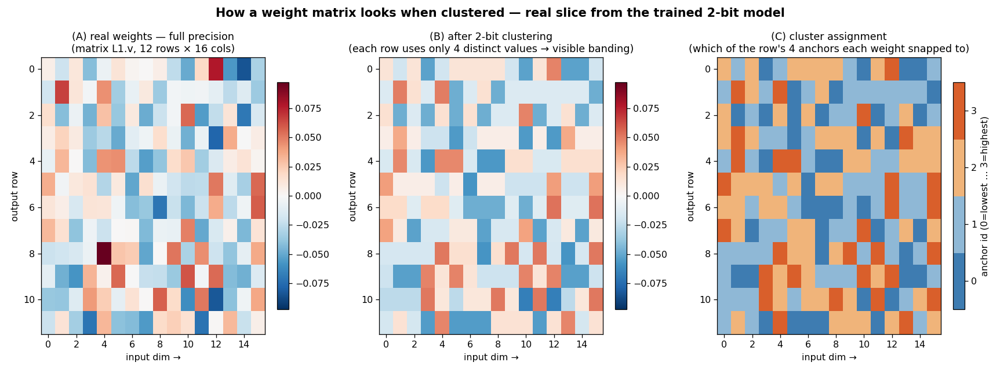

# Appendices — *Quantization Damages Computation, Not Retrieval*

Supporting material for `DRAFT.md`. Abbreviations: Appendix E.

## Appendix A — Quantization details and a worked example

**Per-row vector quantization.** Each quantizable matrix $W\in\mathbb{R}^{d_\text{out}\times d_\text{in}}$
is compressed row-wise. For output row $i$, a codebook $C_i\in\mathbb{R}^k$ of $k$ centroids is
initialized at $k$ evenly spaced empirical quantiles of the row and thereafter trained:

$$C_{i,j}\leftarrow\mathrm{Quantile}\!\left(W_{i,:},\tfrac{j}{k-1}\right),\quad j=0,\dots,k-1.$$

Each weight snaps to its nearest centroid, $\hat W_{i,c}=C_{i,\,a(i,c)}$ with
$a(i,c)=\arg\min_j|W_{i,c}-C_{i,j}|$. A weight costs $\log_2 k$ bits; $k{=}4$ → 2 bits, $k{=}2$ → 1 bit.

**Straight-through estimator (STE)** [Bengio et al. 2013]:

$$W_{\text{ST}}=W+\mathrm{sg}[\hat W-W],\qquad\text{forward}=\hat W,\quad\partial W_{\text{ST}}/\partial W=I,$$

so the full-precision $W$ trains through the non-differentiable rounding — the property enabling the
un-cluster toggle.

**VQ-VAE objective** [van den Oord et al. 2017], per matrix:

$$\mathcal{L}_{\text{vq}}=\underbrace{\lVert\mathrm{sg}[W]-\hat W\rVert_2^2}_{\text{codebook}}+\beta\underbrace{\lVert W-\mathrm{sg}[\hat W]\rVert_2^2}_{\text{commitment}},\qquad\beta=0.25.$$

The target model minimizes masked CE $+\sum_\text{matrices}\mathcal{L}_{\text{vq}}$.

**Worked example (real weights).** One output row of matrix `L1.v`, its learned codebooks, and the
snapped values (first ten entries):

| weight $W_{i,c}$ | 0.007 | 0.022 | 0.009 | −0.036 | −0.027 | −0.049 | −0.011 | −0.004 | 0.017 | −0.007 |
|---|---|---|---|---|---|---|---|---|---|---|
| **2-bit** $\hat W$ (k=4) | 0.006 | 0.037 | 0.006 | −0.020 | −0.020 | −0.055 | −0.020 | 0.006 | 0.006 | 0.006 |
| **1-bit** $\hat W$ (k=2) | 0.075 | 0.075 | 0.075 | −0.081 | −0.081 | −0.081 | −0.081 | −0.081 | 0.075 | −0.081 |

Codebooks: k=4 → `{−0.055,−0.020,0.006,0.037}`; k=2 → `{−0.081,0.075}`. Clustering is **per-row** (each
row learns its own centers). A real 12×16 slice, full-precision vs. 2-bit vs. the cluster-assignment map:

The 192-weight block is stored as 12 codebooks of 4 values (48 numbers) plus one 2-bit index per weight.

## Appendix B — Hyperparameters

| | |
|---|---|
| Model | d=256, 6 layers, 8 heads / 4 KV, head dim 32, SwiGLU inner 672, context 192, tied embeddings |
| Params | 4.32M; 42 quantizable matrices (7 per layer) |
| Quantizer | per-row VQ, k=4 (2-bit), STE, VQ-VAE loss β=0.25 |
| Optimizer | AdamW, lr 3×10⁻⁴, weight decay 0.01, batch 48 |
| Steps | 10,000; curriculum L1→L5 over first 60% |
| Seed | 1 (single-seed; see §6) |
| Data | curriculum lengths 3–5 … 9–12; OOD 13–24 |

## Appendix C — Per-component and per-class tables

Full per-component leave-one-out recovery and elasticity values are in `runs/logs/` (`exp_uncluster.log`,
`exp_uncluster_ood.log`, `exp_h1.log`, `exp_h2.log`); consolidated numbers in `runs/RESULTS.md`.
Class-average elasticity (compute vs. lookup CE rise, 1-bit crush): V 0.087 / O 0.092 ≫ MLP, gate, up,
down ≤0.031 ≫ Q, K. Relative quantization error by class: 0.319–0.344 (uniform).

## Appendix D — E-a / E-b full analysis

E-a (identification token, in-dist vs OOD): EXPLICIT (pos of named anchor) +0.030 / −0.174; IMPLICIT
(shape-selected object) +0.005 / +0.525 — the OOD implicit penalty *looked* like recall-fragility. E-b
(matched object readout at native length; OOD penalty): T1 position +0.85, T3 filter+position +0.50, T4
recall+bind +0.09 — recall+bind is most robust. The OOD penalty tracks OOD control CE (6.66 / 1.95 /
0.47), i.e. extrapolation distance of the computed quantity, not recall. Two failed E-b designs
(common-length; native-length) established that per-query training length and index magnitude are the
confounds. Conclusion: recall is not a distinct fragility axis; F5 (recall-and-bind) retracted.

## Appendix E — Glossary of abbreviations and notation

**Quantization / training.** **CE** cross-entropy loss (lower = better). **VQ** vector quantization
(snap weights to a small codebook). **codebook/centroid/anchor** the allowed values per row. **VQ-VAE**
the codebook+commitment loss we use. **STE** straight-through estimator (gradients pass through
rounding). **sg[·]** stop-gradient. **QAT / PTQ** quantization-aware / post-training quantization.
**fp32** full precision. **bit / k** a k-value codebook costs log₂k bits (k=4→2 bits). **β** commitment
weight (0.25). **un-clustering** turning quantization off for one component (uses fp32 W).

**Prior methods.** **GPTQ** error-correcting PTQ. **AWQ** activation-aware PTQ. **SmoothQuant** outlier
migration. **GPTVQ / AQLM** vector-quantization PTQ. **BitNet** ~1-bit training. **HAWQ** Hessian-aware
mixed-precision (nearest neighbor; §2).

**Architecture.** **LLM** large language model. **MLP** feed-forward block (gate/up/down). **Q,K,V,O**
attention query/key/value/output projections. **GQA** grouped-query attention. **RoPE** rotary position
embedding (rotates Q,K not V). **RMSNorm / SwiGLU** normalization / gated activation. **d** hidden width.

**Analysis.** **OOD** out-of-distribution (longer lists). **`pos N`** scratchpad token writing a computed
position. **SAE** sparse autoencoder (activation-level interpretability). **bit-width elasticity** loss
rise when a component is crushed to 1-bit. **Taylor/gradient saliency** (∂L·W)². **ρ** Spearman rank
correlation. **Δₛ** per-skill quant penalty (target−control CE).

**Labels.** **Q1–Q3** research questions. **F1–F4** findings. **E-a/E-b** the refuted-hypothesis
experiment. **H1/H2** probe experiments. **P1–P4** predictions. **L1–L5** curriculum levels. **six
skills** read, semantic, filter, index, content, relative.

**Policy.** **OECD** Organisation for Economic Co-operation and Development. **OECD AI Principles**
trustworthy-AI values. **OECD.AI Catalogue of Tools & Metrics** the repository of practical
trustworthy-AI tools.

## Appendix F — OECD AI Principles mapping (expanded)

| OECD Principle | Contribution | Evidence |
|---|---|---|
| **Transparency & Explainability** | Circuit-level localization: which weights load-bear which skills, and which capabilities a compression step changed and where | F1, F2, F4; H1–H2 |
| **Robustness, Security & Safety** | Predicts the failure surface before deployment: computation and OOD/long-context reasoning fail first, recall is safe | F1, F3 |
| **Accountability** | Localized, documented capability-deltas as audit-trail evidence for model cards / impact assessments | F4, H1 |

*Governance example.* A public agency deploying a quantized model to triage benefit applications runs the
probe pre-deployment and finds multi-step reasoning over long case histories is a fragile,
computation-heavy circuit that degrades under 2-bit compression while factual recall is untouched. It can
then document: compression is safe for lookup-style tasks but degrades long-context reasoning; keep the
reasoning-critical weight path in higher precision; route complex cases to full precision. *Bound:* this
supports the transparency/robustness slice of trustworthiness, not fairness or societal impact, and is
validated on a testbed pending real-model replication.

## Appendix G — Anticipated objections and responses (R1–R8)

- **R1 (single seed).** No prose rebuttal; 3–5 seeds are the fix (roadmap #1). Within-run controlled
  contrasts (lockstep, monotonic-in-length F3, surgical token localization F2, two independent probes)
  carry the current evidence.
- **R2 (toy / synthetic).** The claim is mechanistic; controlled dissociation is impossible at scale.
  P1 is already consistent with published GSM8K-vs-MMLU quantization degradation [Feng et al. 2026]. A
  small GPTQ per-token experiment on Pythia-160M (roadmap #2) is the direct strengthening.
- **R3 (nonstandard quantizer).** The mechanism (bounded vs. growing output ranges) is quantizer-agnostic;
  QAT-with-STE is the *harder* setting for finding damage. A PTQ ablation on the testbed (roadmap #4)
  tests generality.
- **R4 (HAWQ?).** HAWQ is a compression budget; we add per-skill causal decomposition, the extrapolation
  mechanism, and the demonstration (H2) that elasticity captures discrete-tolerance a second-order
  measure misses.
- **R5 (co-adaptation caveat undermines F4).** Restructured: leave-one-out is primary, class-level is
  magnitude-only corroboration; the caveat applies to sign of a secondary analysis.
- **R6 (ρ=0.55 weak).** 42/42 directional agreement is the validation; the structured (class-organized)
  residual is a finding, not noise. See the H2 scatter.
- **R7 (small CE deltas).** On a fully-learned task, ratios and OOD deltas (+0.85, E-b) are the meaningful
  units; converged control CE is near zero.
- **R8 (weights not activations).** Complementary granularity: SAEs decompose what is represented, the
  probe fingerprints what a component does; useful as cheap triage before activation-level tools.
