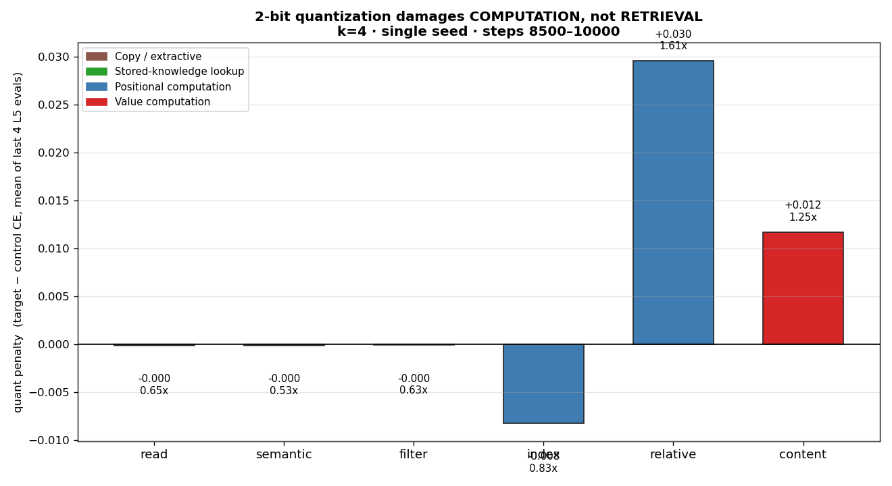
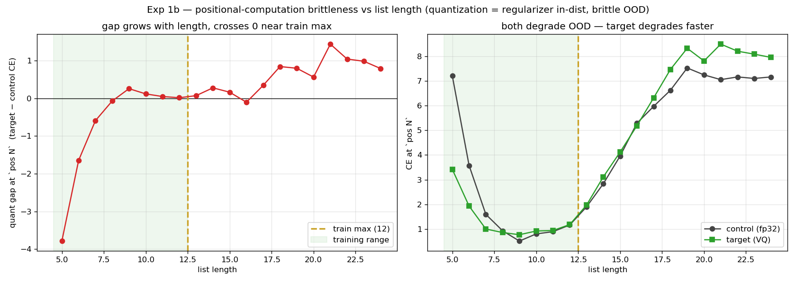
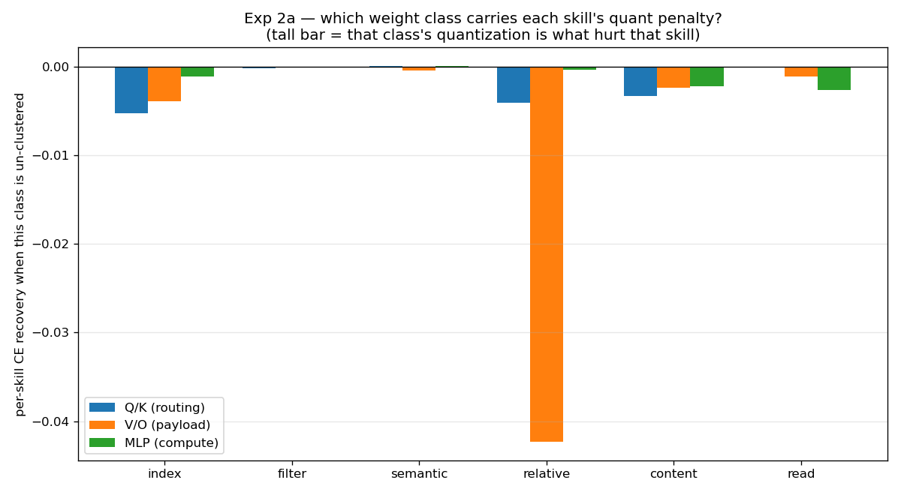
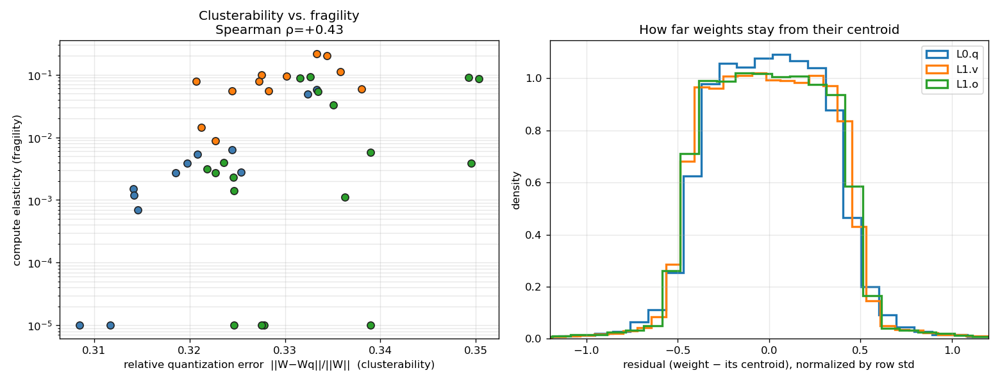
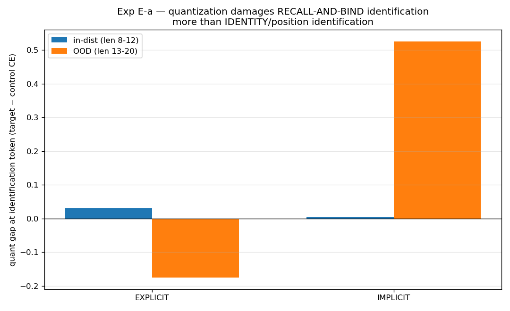
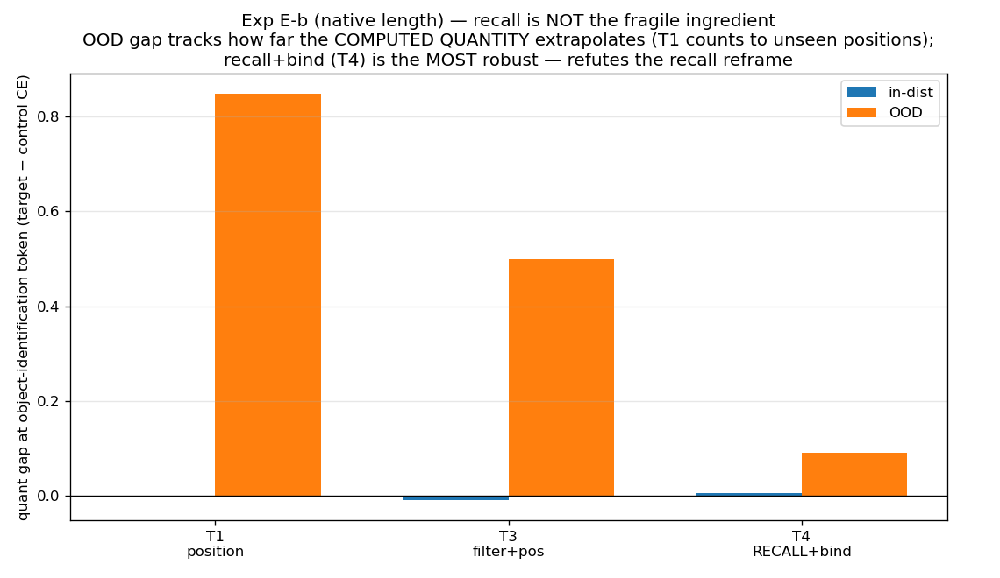
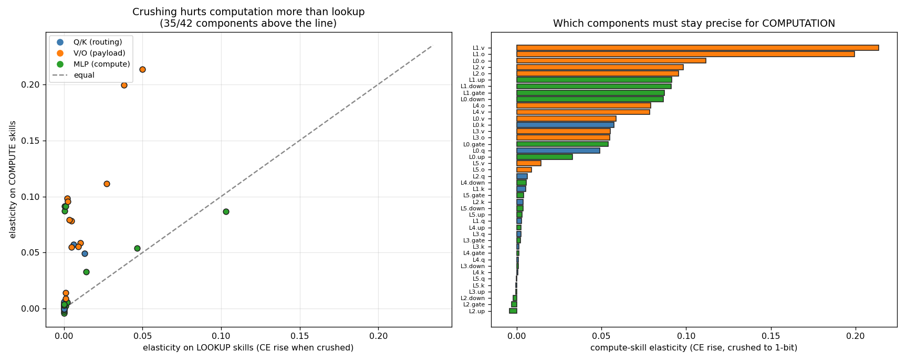
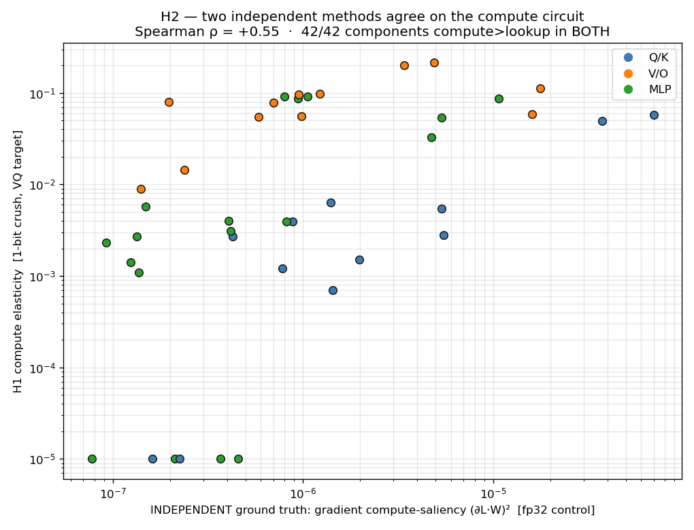

# Quantization Damages Computation, Not Retrieval: A Controlled Dissociation

*Working draft, restructured to NeurIPS format. Figures in `runs/`, exact numbers in `runs/RESULTS.md`,
abbreviations in Appendix E. Single-seed study on a mechanistic testbed (see §6 for scope).*

## Abstract

Weight quantization is evaluated by aggregate metrics — perplexity and downstream accuracy — that report
how much a model degrades but not which capability is lost. We give a controlled, per-skill causal
account on a testbed engineered to dissociate six reasoning sub-skills, training a full-precision control
and a 2-bit vector-quantized target in lockstep (identical initialization and batches) so that every
per-skill and per-token loss difference is attributable to quantization alone. Quantization damage is
strongly skill-selective: associative-lookup skills (recall, filtering, copying) compress essentially
for free, while multi-step computation skills (relative positioning, value comparison) pay a consistent
penalty. A single mechanism accounts for this — quantization is a brittle extrapolator, free or even
regularizing in-distribution and damaging in proportion to how far a computed quantity extrapolates
beyond the training range — and a tempting recall-conditioned alternative is falsified by a
length-controlled experiment. The damage localizes to the value/output projections and to the tokens
that emit computed quantities; a weight-space analysis shows all matrices cluster equally tightly, so
fragility is functional sensitivity, not compressibility. Finally, the method yields a reusable probe:
per-component bit-width elasticity separates computation from lookup machinery and agrees with
gradient-based importance on the full-precision model. We give four predictions for production LLMs, one
already consistent with reported quantized-model degradation on mathematical reasoning.

## 1. Introduction

Post-training quantization and quantization-aware training compress large language models (LLMs) to 2–4
bits at small aggregate cost [Frantar et al. 2023; Lin et al. 2024]. But aggregate metrics average over
token types dominated by fluent, recall-like predictions, so they under-weight the reasoning tokens that
matter and cannot say *what* a given quantizer breaks. Recent evaluations report that quantized models
degrade disproportionately on multi-step reasoning (GSM8K, MATH) relative to knowledge benchmarks (MMLU)
[Feng et al. 2026; Gong et al. 2026], but offer no controlled mechanistic account of *why*.

We provide one, organized around three questions:

- **Q1 (what breaks).** Is quantization damage skill-selective?
- **Q2 (where).** Does the damage co-localize with where a skill is computed?
- **Q3 (when).** How does it interact with compositional complexity and length generalization?

The controlled attribution these require is impossible at scale — one cannot train a production model
twice in lockstep — so we use a testbed small enough to dissect completely and rich enough to dissociate
six reasoning sub-skills. Our contributions:

1. **A causal per-skill protocol.** Paired-lockstep quantization (control vs. target from identical
   initialization and batches) with per-token skill labeling isolates quantization's effect on each
   sub-skill and each reasoning step — an attribution aggregate benchmarks cannot make.
2. **A skill-selective result and a unifying mechanism.** Computation is damaged, retrieval is free; one
   rule, *brittle extrapolation*, explains the skill, token, and length effects. We falsify a competing
   recall-conditioned hypothesis with a controlled experiment.
3. **Localization.** The fragile computation lives in the value/output path and on the quantity-emitting
   tokens; a weight-space analysis shows it is functional *sensitivity*, not weight *compressibility*.
4. **A validated interpretability probe.** Per-component *bit-width elasticity* fingerprints functional
   roles from quantization sensitivity and agrees with an independent, non-quantization ground truth.

**Summary of findings.**

| Question / claim | Finding | Evidence |
|---|---|---|
| Q1 — skill-selective? | Computation damaged (relative 1.61×, content 1.25×); lookup free (≤1.0×) | §4.1 (F1) |
| Q3 — complexity/length? | Regularizes in-distribution, brittle out-of-distribution, monotonic in length | §4.2 (F3) |
| Q2 — where? | Value/output path; the quantity-emitting tokens; sensitivity not compressibility | §4.3 (F2/F4) |
| Competing recall hypothesis | Falsified — recall+bind is the *most* robust, not the least | §4.4 (E-a/E-b) |
| Reusable probe? | Elasticity separates computation from lookup; agrees with fp32 gradients | §5 (H1/H2) |

## 2. Related Work

**Quantization methods and their evaluation.** Post-training quantization scales weights to low bit-width
via error-correcting (GPTQ [Frantar et al. 2023]), activation-aware (AWQ [Lin et al. 2024]), or
outlier-migrating (SmoothQuant [Xiao et al. 2023]) schemes; vector-quantization methods learn codebooks
over weight groups (GPTVQ [van Baalen et al. 2024], AQLM [Egiazarian et al. 2024]), and BitNet trains
near-1-bit models directly [Ma et al. 2024]. These are evaluated by perplexity and task accuracy;
recent benchmark studies find aggressive quantization degrades reasoning (GSM8K, MATH) earlier than
knowledge tasks [Feng et al. 2026; Gong et al. 2026; Kim et al. 2025], attributing it informally to
error accumulation across steps. We supply the controlled mechanism behind that observation and localize
it to components — neither of which aggregate benchmarks provide.

**Mixed-precision sensitivity (our nearest neighbor).** HAWQ [Dong et al. 2019] and its successors assign
per-layer bit-widths from second-order (Hessian) sensitivity — a *compression budget*. We differ in
three ways a reviewer should weigh. (i) HAWQ measures sensitivity to *set a bit-width*; it never asks
what the sensitivity *means*, and does not decompose it by capability. Our per-skill causal
decomposition (§4.1) requires the token labeling and lockstep pairing that HAWQ lacks. (ii) We identify
the *mechanism* (bounded vs. growing output ranges, §4.2), which HAWQ does not address. (iii) We show
that coarsening-tolerance (elasticity) captures *discrete*-quantization structure that a local
second-order measure misses: elasticity and gradient importance agree on the compute-vs-lookup axis but
disagree, in a structured way, on weight class (§5, H2). In short, HAWQ is a budgeting tool; ours is a
diagnostic-and-mechanism.

**Interpretability.** Sparse autoencoders decompose *activations* into features [Cunningham et al. 2023;
Bricken et al. 2023]; causal ablation and gradient attribution localize behavior to components; the
key–value view of MLPs [Geva et al. 2021] and induction-head analyses [Olsson et al. 2022] establish
mechanisms on small models before they are found at scale. We operate on *weights* rather than
activations, characterizing what a component *does* (transform vs. store) rather than what it represents,
and validate our probe against gradient attribution.

## 3. Method

**Task and per-token labeling.** A flat list interleaves objects and numbers, e.g.
`[75, coin, ball, card, 69, 52, 62]` (1-indexed from the left). Objects carry a *latent* shape —
ball/coin/ring → round, box/book/card → flat — that appears nowhere in the input and must be learned, as
an LLM silently knows properties of words. Six sub-skills compose the queries: **read** (copy),
**semantic** (recall the latent shape), **filter** (number vs. object), **index** (count to a position),
**content** (compare a value to a threshold), **relative** (locate relative to an anchor). The model
emits a scratchpad [Nye et al. 2021] and then the answer, and **every generated token is labeled with the
single skill it exercises.** For *"2nd element after first card"*:

```
[relative]  anchor first card -> pos 4
[index]     2 after -> pos 6 = 52
[read]      A 52
```

A five-level curriculum grows list length (L1: 3–5 … L5: 9–12); out-of-distribution (OOD) evaluation
uses lengths 13–24.

**Paired-lockstep protocol (headline method).** We build one full-precision (fp32) model, deep-copy it,
and quantize the copy; control and target then train from *identical initialization on identical
batches*. Any per-skill or per-token loss gap is therefore quantization's causal effect, with
initialization and data variance eliminated by construction — the attribution that makes the rest of the
paper possible. Both use AdamW (lr $3\times10^{-4}$, weight decay 0.01), batch 48, 10k steps; the
curriculum raises the maximum level over the first 60% of training. Model: a 4.32M-parameter Qwen2
replica (d=256, 6 layers, 8/4 grouped-query attention [Ainslie et al. 2023], RoPE [Su et al. 2021],
SwiGLU, RMSNorm, tied embeddings), with 42 quantizable matrices (attention `q,k,v,o`; MLP
`gate,up,down`).

**Quantization.** Each matrix is compressed row-wise: for output row $i$, a learned codebook
$C_i\in\mathbb{R}^k$ of $k$ centroids (initialized at $k$ empirical quantiles of the row) snaps each
weight to its nearest centroid, $\hat W_{i,c}=C_{i,\,\arg\min_j|W_{i,c}-C_{i,j}|}$ ($k{=}4$ → 2 bits). A
straight-through estimator [Bengio et al. 2013] keeps the full-precision $W$ trainable, and the codebook
is learned with a VQ-VAE objective [van den Oord et al. 2017]. Full equations, and a worked numerical
example with a real weight matrix, are in Appendix A.

**Un-cluster toggle.** Because the estimator keeps $W$ alive, setting a component's quantize flag to
false makes its forward pass use $W$ directly — an exact, retraining-free *leave-one-out un-quantization*
used for localization (§4.3) and as the basis of the probe (§5).

**Loss decomposition.** With $\text{ce}_t$ the per-token cross-entropy (CE) and $s_t$ the skill label of
target token $t$,

$$\mathrm{CE}_s=\frac{\sum_t \mathbb{1}[s_t=s]\,\text{ce}_t}{\sum_t \mathbb{1}[s_t=s]},\qquad
\Delta_s=\mathrm{CE}_s^{\text{target}}-\mathrm{CE}_s^{\text{control}}.$$

Shared initialization and batches make $\Delta_s$ quantization's causal effect on skill $s$.

## 4. Results: what breaks, where, and when

### 4.1 Skill-selectivity (F1)

Converged per-skill 2-bit penalty $\Delta_s$: read/semantic/filter/index $\approx 0$ (ratios $\le 0.83\times$);
**content $+0.012$ ($1.25\times$)** and **relative $+0.030$ ($1.61\times$)** are the only real penalties.
Retrieval-type skills compress for free; computation-type skills pay, and the deeper computation
(relative, a two-stage anchor-then-offset) exceeds the shallow one (index). This is a corollary of the
mechanism in §4.2.



### 4.2 The extrapolation mechanism (F3)

The explanatory core. Measuring the penalty on the quantity-emitting token as a function of list length:
absolute difficulty is U-shaped (minimum at the training mode), and control and target **cross at the
training distribution** — the quantized target is *better* than fp32 in-distribution (quantization
regularizes) and progressively *worse* out-of-distribution. Formally:

> Quantization is free (even regularizing) in-distribution and damages an operation in proportion to how
> far the **quantity it must compute** extrapolates beyond training.

Skill-selectivity (§4.1) follows immediately: lookup skills have small **bounded** output spaces
(round/flat, object names) that never extrapolate → free; computation skills produce quantities
(positions, counts) whose range **grows with input** → fragile OOD.



### 4.3 Localization: token and component (F2, F4)

**Token level (F2).** In relative traces the entire difficulty concentrates on the token emitting the
computed position (`pos N`): control CE spikes ~1000× there and is near-zero elsewhere, and the quant
gap rides the same spike (a second emission → a second spike). Once a position is written as a token,
downstream steps are quant-free — the scratchpad launders a fragile computed quantity into a robust
symbol.


**Component level (F4), leave-one-out first.** Un-clustering individual components (the trustworthy,
retraining-free intervention) shows `relative`'s recoverable penalty concentrated in early-layer
value/output components. Aggregating to weight classes corroborates: `relative` is dominated by the
value/output projections (≈10× Q/K), consistent with a RoPE account in which position is consumed by the
Q/K softmax and reaches the MLP only after being written into the value stream as content. **Caveat,
stated up front:** whole-class un-clustering is confounded in *sign* by straight-through co-adaptation
(un-clustering many matrices at once breaks the co-adapted forward pass); we therefore treat class-level
results as magnitude-only corroboration of the component-level leave-one-out, not as independent causal
claims.



**Fragility is sensitivity, not compressibility.** A natural alternative — computation matrices are
simply harder to cluster — is ruled out. The relative quantization error $\lVert W-\hat W\rVert/\lVert W\rVert$
is uniform across all seven classes (0.31–0.35): every roughly-Gaussian row loses ~1/3 of its energy to
2-bit rounding regardless of function, and the residual distributions of a fragile value matrix and a
robust query matrix are identical. Yet elasticity varies four orders of magnitude. Computation matrices
compress *just as tightly*; they are fragile because the function amplifies the same weight error into a
larger loss.



### 4.4 A falsified alternative (E-a, E-b)

We tested a stronger hypothesis: that quantization spares knowledge *recall* but damages
knowledge-conditioned *identification* (recall-and-bind). One experiment (E-a) appeared to support it.
A length-controlled follow-up (E-b), testing each query at its native training length, **falsified it**:
recall-and-bind was the *most* quantization-robust operation (OOD penalties: position-only $+0.85$,
filter+position $+0.50$, recall+bind $+0.09$). The apparent effect in E-a was an extrapolation-distance
confound. This is our clearest evidence that the apparatus distinguishes hypotheses rather than
reflecting noise, and that the surviving claim is the extrapolation rule, not recall.





## 5. The elasticity probe

Define a component's **bit-width elasticity** as the loss increase when it alone is crushed to 1-bit.
Hypothesis: elasticity is a functional fingerprint — discrete/lookup machinery tolerates coarsening;
analog/computation machinery does not.

**H1.** Crushing a component hurts computation more than lookup for all seven weight classes (ratios
1.8–10.2×; 35/42 components), the map recovers the value/output localization of §4.3, and it is not a
magnitude artifact (corr(elasticity, weight-std) = −0.15).



**H2 — validation against a non-quantization ground truth, and the ρ=0.55 head-on.** Gradient (Taylor)
saliency $(\partial L\cdot W)^2$ on the fp32 control — no quantization — ranks all 42 components
computation-critical over lookup-critical (42/42), and agrees with elasticity at Spearman ρ = 0.55.
**We confront the moderate ρ directly:** the 42/42 directional agreement is the validation; the imperfect
*rank* correlation is not noise but *structure* — gradients (a local, infinitesimal measure) rank Q/K
highest because routing has steep local gradients, whereas elasticity (a global, discrete measure) ranks
V/O highest because the value payload is least tolerant to coarse rounding. The scatter, colored by
weight class, shows this disagreement is organized by class, not scattered. A probe perfectly correlated
with gradients would be redundant; the structured residual is what makes elasticity a distinct tool that
captures discrete-tolerance a second-order measure misses — the concrete claim in our §2 differentiation
from HAWQ.



**Scope and outlook — a typing layer, not a tracer.** We are deliberate about what this probe is and is
not. Elasticity is a *functional-typing* instrument: it labels a component as computation-bearing
(precision-sensitive) or lookup-bearing (precision-robust), and its concentration measures localization
vs. diffusion. It is *not* a general circuit-tracer — it says nothing about *what* a representation
encodes (monosemantic vs. polysemantic) or *how* information flows through the residual stream, which are
activation-space questions best answered by linear probing, activation patching, and sparse
autoencoders. Its value is complementary and, we believe, unique: probing and patching can *locate* a
circuit and describe *what* it represents, but cannot say whether that circuit *computes* or *looks up*;
elasticity supplies exactly that label. We therefore propose a **locate-then-type** pipeline — use
probing/patching to find and characterize a circuit, then overlay elasticity / leave-one-out
un-quantization to type it — producing, for any located circuit, a joint *(causal-role, functional-type)*
description neither tool family gives alone. Preliminary residual-stream probes on controlled
minimal-pair inputs are consistent with this division of labor (e.g. a content-matching fetch operation
localizes to attention and types as precision-robust, while the arithmetic it feeds types as fragile);
we leave a full locate-then-type circuit study to future work.

## 6. Predictions and limitations

**Predictions (with their falsification protocol).** The mechanism yields four testable predictions for
production LLMs; the real-model replication we scope below is designed to falsify them.
**(P1)** Quantized LLMs keep facts but lose reasoning; aggregate benchmarks underestimate reasoning harm.
*Already consistent* with reported quantized-model degradation on GSM8K/MATH exceeding that on MMLU
[Feng et al. 2026; Gong et al. 2026].
**(P2)** Chain-of-thought is a quantization-robustness mechanism (it keeps computed quantities small and
in-range); quantized models should benefit disproportionately from explicit intermediate tokens.
**(P3)** Long-context positional/relational reasoning is a specific casualty, localized to the
value/output path — motivating *function-guided mixed precision*.
**(P4)** Quantization regularizes in-distribution but worsens extrapolation, so OOD-free evaluations
misjudge which quantizer is safe for reasoning.

**Falsification protocol.** GPTQ-quantize a small pretrained model (Pythia-160M / Qwen2-0.5B) and measure
the per-token loss gap on numeric/computed tokens vs. copy tokens; P1 predicts the gap concentrates on
the former. Extending the per-skill and elasticity analyses to that model tests P3 and the probe's
transfer.

**Limitations.** A 4.32M synthetic testbed, **single seed**, one bit-width (k=4), one quantizer (learned
per-row VQ under QAT). Single-seed variance in the quantization interaction is unmeasured; the
within-run controlled contrasts (lockstep pairing, monotonicity in length, surgical token localization,
agreement of two independent probes) carry the current evidence, and 3–5 seeds are the first
strengthening step. QAT-with-STE is the *harder* setting for finding damage (the model adapts around the
quantizer), so surviving damage is more likely fundamental; a scale/rounding PTQ (GPTQ) ablation would
test quantizer-generality. Absolute in-distribution CE deltas are small because the task is fully learned
(ratios and OOD deltas — e.g. $+0.85$ in E-b — are the meaningful units).

## 7. Conclusion

On a controlled testbed, low-bit quantization damages computation and spares retrieval, in proportion to
how far a computed quantity extrapolates beyond training, localized to the value/output path and the
quantity-emitting tokens; the fragility is functional sensitivity, not weight compressibility. A
recall-conditioned alternative is falsified by a controlled experiment. The same sensitivity, read as a
map, is a validated interpretability probe. Finding and tool point to one target: protect the computation
path, and let the model write its fragile quantities down.

## Broader impact

Compression is a governance blind spot: applied ubiquitously for efficiency, its effect on specific
capabilities goes undocumented, so a compressed model can look "97% as good" while having lost a
capability that matters. Our method makes that effect *auditable* — which capabilities a compression step
changed, and where — and predicts the failure surface (computation and long-context reasoning fail first,
recall is safe). This supplies transparency and robustness evidence of the kind trustworthy-AI frameworks
call for (e.g. the OECD AI Principles' transparency, robustness, and accountability aims; the
tool-and-metric layer catalogued by the OECD.AI Policy Observatory), and a concrete mitigation
(function-guided mixed precision; route hard cases to full precision). It addresses the transparency and
robustness slice of trustworthiness, not fairness or societal-impact, and is validated on a testbed
pending real-model replication. Appendix F expands the principle-by-principle mapping.

---

## Next immediate steps (project roadmap — not part of the submission)

*Pick from these; ordered by how much each moves the accept/reject line, per the review.*

1. **Seeds (R1) — the top priority; needs GPU (~$15, hours).** Run 3–5 seeds of the paired-lockstep
   training; report mean ± std on every $\Delta_s$ and on the elasticity map. This is the one objection
   with no prose rebuttal. *Blocker: too slow on the current CPU (~7h/run); needs a rented GPU.*
2. **Real-model PTQ experiment (R2) — converts "toy" to "validated mechanism."** GPTQ-quantize
   Pythia-160M; show the per-token loss gap concentrates on numeric/computed tokens vs. copy tokens.
   Even a rough version defuses the scale objection more than any prose. *Feasible on CPU but heavy;
   cleaner on GPU.*
3. **Real-model per-skill + elasticity transfer (extends #2).** Run the per-skill decomposition and the
   elasticity probe on the same small model — tests P3 and the probe's transfer directly.
4. **PTQ ablation on the testbed (R3).** Quantize the *testbed* model with a GPTQ-style rounding
   quantizer (no learned codebook) and check the computation-vs-lookup dissociation still holds — tests
   quantizer-generality. *Checkpoint-adjacent; moderate.*
5. **References pass.** Verify every citation below against the originals (arXiv IDs/years from memory
   may be imperfect) and add any missing quantization-hurts-reasoning refs.
6. **Two-build split.** Produce the OECD-framed build (restore executive summary + full §7) from this
   same source, for the policy audience, keeping this file as the NeurIPS build.
7. **Appendix polish.** Fill Appendices A–F (VQ details + worked example already drafted; hyperparameters;
   full per-component tables; E-a/E-b full analysis; glossary; OECD mapping; R1–R8 rebuttals).

---

## References

*Citation details (arXiv IDs, years, venues) should be verified against the originals before submission —
see roadmap step 5.*

- Ainslie et al. **GQA: Training Generalized Multi-Query Transformer Models from Multi-Head Checkpoints.** EMNLP 2023. arXiv:2305.13245.
- Bengio, Léonard, Courville. **Estimating or Propagating Gradients Through Stochastic Neurons.** 2013. arXiv:1308.3432.
- Bricken et al. **Towards Monosemanticity: Decomposing Language Models with Dictionary Learning.** Anthropic, 2023.
- Cunningham et al. **Sparse Autoencoders Find Highly Interpretable Features in Language Models.** 2023. arXiv:2309.08600.
- Dong et al. **HAWQ: Hessian AWare Quantization of Neural Networks with Mixed-Precision.** ICCV 2019. arXiv:1905.03696.
- Egiazarian et al. **Extreme Compression of Large Language Models via Additive Quantization (AQLM).** ICML 2024. arXiv:2401.06118.
- Feng et al. **Quantization Meets Reasoning: Exploring LLM Low-Bit Quantization Degradation for Mathematical Reasoning.** 2026. arXiv:2501.03035.
- Frantar et al. **GPTQ: Accurate Post-Training Quantization for Generative Pre-trained Transformers.** ICLR 2023. arXiv:2210.17323.
- Geva et al. **Transformer Feed-Forward Layers Are Key-Value Memories.** EMNLP 2021. arXiv:2012.14913.
- Gong et al. **Which Quantization Should I Use? A Unified Evaluation of llama.cpp Quantization on Llama-3.1-8B-Instruct.** 2026. arXiv:2601.14277.
- Kim et al. **Benchmarking Post-Training Quantization in LLMs.** 2025. arXiv:2502.13178.
- Lin et al. **AWQ: Activation-aware Weight Quantization for LLM Compression and Acceleration.** MLSys 2024. arXiv:2306.00978.
- Ma et al. **The Era of 1-bit LLMs: All Large Language Models are in 1.58 Bits (BitNet b1.58).** 2024. arXiv:2402.17764.
- Nye et al. **Show Your Work: Scratchpads for Intermediate Computation with Language Models.** 2021. arXiv:2112.00114.
- Olsson et al. **In-context Learning and Induction Heads.** Anthropic, 2022. arXiv:2209.11895.
- Su et al. **RoFormer: Enhanced Transformer with Rotary Position Embedding.** 2021. arXiv:2104.09864.
- van Baalen et al. **GPTVQ: The Blessing of Dimensionality for LLM Quantization.** 2024. arXiv:2402.15319.
- van den Oord, Vinyals, Kavukcuoglu. **Neural Discrete Representation Learning (VQ-VAE).** NeurIPS 2017. arXiv:1711.00937.
- Xiao et al. **SmoothQuant: Accurate and Efficient Post-Training Quantization for LLMs.** ICML 2023. arXiv:2211.10438.

---
*Figures: `grouped.png` (F1), `exp1b.png` (F3), `exp1a.png` (F2), `exp2a.png` (F4),
`exp_cluster_tightness.png` (sensitivity vs. clusterability), `exp_ea.png`/`exp_eb.png` (E-a/E-b),
`exp_h1.png`/`exp_h2.png` (probe), `matrix_cluster.png` (Appendix A). Reproduce from `ckpt.pt` with
`exp_*.py`. Appendices A–F and the glossary are maintained separately in the repository.*
