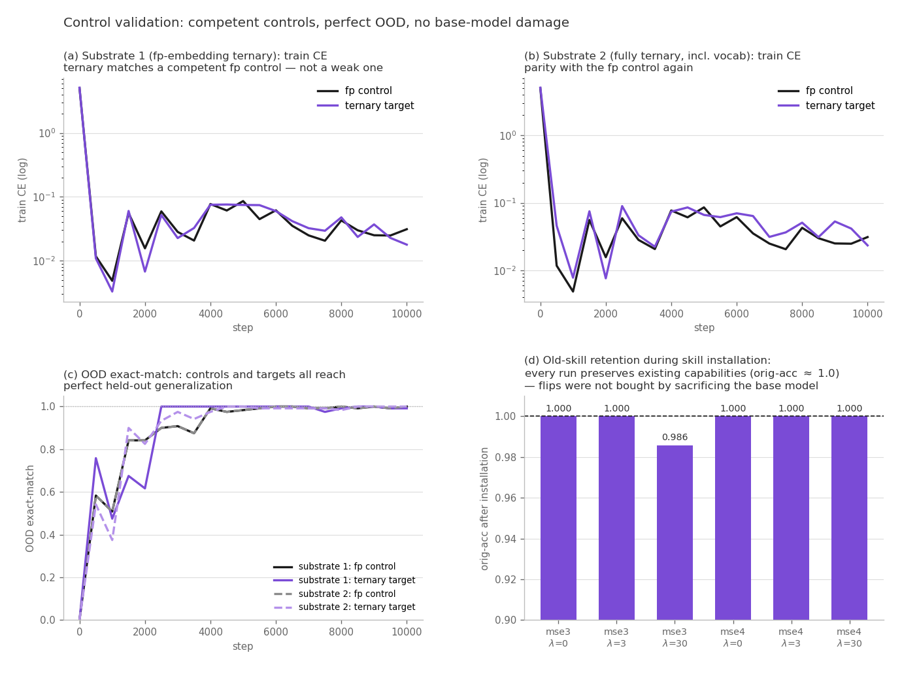

# Learning as Minimum Symbolic Edit: What It Costs to Install a Skill in a Ternary Network

*Working draft (paper 2 of this research program; companion to `DRAFT.md`). Code: `finetune_mse*.py`,
`retrieval_data_sign.py`, `exp_flip*.py`, `exp_named_wires.py`, `exp_ddmin_l0.py`. Results:
`runs_mse*/`, `runs_ternary/`. Single-seed study on a 4.3M-parameter ternary testbed; see §8.*

## Abstract

In a ternary network every weight is a discrete symbol in {−1, 0, +1}, so learning has a natural
integer-valued cost: the number of weights that change symbol. We formalize learning a new skill as
**minimum symbolic edit** — minimize task loss plus a KL-based edit penalty that prices every symbol
change equally — and ask how many discrete edits a new skill actually requires. The answer required
three successively stricter experiments, each dismantling the previous one, and we report all three.
(1) Naively, an edit penalty appears spectacularly effective: a new skill installs at 100% accuracy
with as few as 284 flipped weights out of 4.28M. (2) Forensic controls show this is an illusion:
the flipped weights are optimizer noise (15–25% overlap across runs; reverting *all* of them changes
nothing), and the skill has migrated into the unpenalized continuous channels — almost entirely the
embedding table, which can memorize per-token answers. (3) Closing every continuous channel (frozen
embeddings, biases, norms, and quantization scales) and reducing the new vocabulary to a single token
(`-`), so the skill is forced to be *compositional*, yields the true measurement: the skill costs
**~9,200 trit flips (0.21%) at full accuracy**, degrades below ~4,000, and the edit objective still
compresses the necessary circuit **38×** relative to unconstrained fine-tuning. Dissecting the
resulting circuit shows it is **layer-local** (one layer plus one late neuron carries 100% of the
skill), **hub-structured** (the same weight coordinates recur across independent runs), and
**hologram-redundant** (no single flip is individually necessary; aggressive minimization overfits and
halves held-out accuracy). We draw two lessons: an optimizer under an edit penalty will launder
learning into any unpriced parameter channel; and skills that can be memorized token-wise live in
embeddings, while compositional skills demand coordinated weight edits — the lookup-versus-computation
divide of our companion paper, seen from the learning side.

## 1. Introduction

Model editing and parameter-efficient fine-tuning ask how *little* of a network must change to add or
alter a capability, but in continuous weights "how little" has no natural unit: norms conflate many
small drifts with few decisive changes. Ternary (1.58-bit) networks change this. When every weight is
−1, 0, or +1, learning is a set of **discrete symbol flips**, and "how much did the model change?"
has an exact integer answer. This paper asks and answers three questions on a ternary testbed:

- **Q1 (objective).** Can an explicit edit-cost objective install a new skill with far fewer symbol
  flips than unconstrained fine-tuning, at no accuracy cost?
- **Q2 (measurement).** What is the *true* minimal symbolic cost of a new skill — and what
  experimental controls are required before a flip count can be believed?
- **Q3 (structure).** What does the resulting circuit look like — localized or diffuse, minimal or
  redundant, nameable or cloud-like?

### Contributions

1. **An equal-cost symbolic edit objective.** A KL penalty on per-weight state distributions that
   prices −1→0, 0→+1, and −1→+1 identically (an L1 penalty on weights mis-prices the last as a double
   edit), combined with a straight-through ternary forward and a commitment term (§3).
2. **A cautionary result with full forensics.** The naive protocol produces flip counts that shrink
   to 284 and then, under controls, to **zero**: the skill relocates into unpenalized continuous
   parameters, chiefly the embedding table (§5). We give the two controls that expose this — cross-run
   flip-set overlap and the zero-flip revert — and recommend them for any discrete-editing claim.
3. **The leak-proof protocol and the true cost.** With every continuous channel frozen and the new
   vocabulary reduced to one token so the skill cannot be memorized token-wise, the skill costs ~9.2k
   flips at 100%/100% (new/old skills), with degradation beginning below ~4k; the edit objective still
   achieves a 38× reduction over unconstrained fine-tuning (§6).
4. **Circuit anatomy.** The installed circuit is exactly layer-local, reproducibly hub-structured,
   and massively redundant: 0 of 2,896 flips are individually necessary, hubs are necessary-but-not-
   sufficient, and ddmin-style minimization overfits its search set — minimal is not robust (§7).

### Summary of findings

| Question | Finding | Where |
|---|---|---|
| Does the edit objective work? | Yes mechanically — but it exploits any unpriced channel first | §5 |
| Where did the skill go under penalty? | The embedding table (0 necessary flips; orig-net + FT embeddings = 0.986) | §5 |
| True cost of a compositional skill | ~9.2k flips (0.21%) full accuracy; <4k degrades; 38× compression | §6 |
| Vocabulary vs circuit | 34 dedicated tokens: embeddings alone reach 0.986. One shared token: 0.000 — circuits required | §5–6 |
| Circuit shape | One layer (+1 late neuron) = 100% of skill; recurring hubs; no single flip necessary | §7 |
| Can it be minimized further? | To ~1.3k only by overfitting (held-out 0.986→0.643): minimal ≠ robust | §7 |

## 2. Related work

**Ternary and low-bit training.** BitNet and BitNet b1.58 [Wang et al. 2023; Ma et al. 2024] train
transformers with binary/ternary weights via absmean scaling, round-and-clamp, and a straight-through
estimator [Bengio et al. 2013] — the substrate we adopt (adding a small VQ-VAE-style commitment term
[van den Oord et al. 2017]). Those works establish that ternary networks match full precision at
scale; we use the discreteness itself as a *measurement instrument* for learning.

**Model editing and parameter-efficient fine-tuning.** ROME and MEMIT [Meng et al. 2022; 2023] edit
factual associations by low-rank updates to specific MLP layers; LoRA [Hu et al. 2021] restricts
updates to low-rank adapters; prompt/prefix tuning [Lester et al. 2021; Li & Liang 2021] learns only
input-space vectors over a frozen network. Our Act-2 finding — that an edit-penalized optimizer
spontaneously reinvents embedding-only learning — connects the editing and prompt-tuning literatures:
*which* channel learning flows into is determined by which channels the objective prices. Our leak-
proof protocol is, to our knowledge, the first to force learning entirely into discrete weight symbols
and count them.

**Sparsity, redundancy, and circuits.** The lottery-ticket line [Frankle & Carbin 2019] finds sparse
trainable subnetworks; interpretability work localizes behaviors to heads and MLP key-value memories
[Geva et al. 2021] and documents distributed, redundant representations under superposition [Elhage
et al. 2022]. Our anatomy results give a discrete-substrate version: a skill that is exactly
layer-local yet internally redundant, with reproducible hubs that are necessary but nowhere near
sufficient — and a demonstration that circuit *minimization* (ddmin over flips) overfits, echoing the
minimal-vs-robust distinction in pruning.

## 3. Method

**Substrate.** A 4.32M-parameter Qwen2-style decoder (d=256, 6 layers, GQA 8/4, RoPE, SwiGLU) with
all 42 attention/MLP matrices ternarized BitNet-style: per-row scale s = mean|w| (absmean), forward
weight ŵ = s·clamp(round(w/s), −1, +1), straight-through gradients to the latent w, plus a commitment
loss β‖w − sg(ŵ)‖² (β=0.25). Trained to convergence on a six-skill retrieval task (lists of objects
and numbers; queries over position, comparison, and latent properties — see companion paper). The
trained ternary model matches its full-precision lockstep control in-distribution. **A trit** is one
weight's symbol ∈ {−1, 0, +1}; the model has 4.28M trits.

**The new skill.** "Find the first negative number." Negative numbers do not exist in the base task;
installing the skill requires new vocabulary and (in the strict design) a new *relational* judgment.

**Minimum symbolic edit objective.** With p(w) = softmax over states t ∈ {−1,0,+1} of −(w/s − t)²/τ
(τ = 0.2, s detached) and q_orig the one-hot of the weight's original symbol:

L = L_task + L_quant + λ_e · CE(q_orig, p)

The KL/CE edit term prices **every symbol change equally** — including −1→+1, which an L1 penalty on
weight values would double-count. λ_e sweeps from 0 (unconstrained) to 30 (harsh).

**Flip counting.** After training, flips = positions where clamp(round(w/s)) differs from the
original ternary model, counted against 4.28M.

**The three experimental acts** differ only in what else may change:

| | new vocab | embeddings | biases/norms | row scales | weights (trits) |
|---|---|---|---|---|---|
| Act 1 (naive) | 32 number tokens + 2 words | trainable | trainable | dynamic | trainable + penalty |
| Act 2 (forensics) | — analysis of Act 1 — | | | | |
| Act 3 (leak-proof) | **one token: `-`** | **frozen** (after a vocabulary-only phase) | **frozen** | **frozen** | **only trainable channel** |

In Act 3, negative numbers are compositional — `- 47` is two tokens, and magnitudes are drawn from
the *same* range as positive values (20–99), so **the only signal of negativity is the preceding `-`
token**: the skill cannot be memorized per-token and must be implemented as a relational circuit.
Phase 1 trains only the single `-` embedding row (everything else frozen); phase 2 freezes *all*
continuous parameters — embeddings, biases, RMSNorm weights, and the ternary scales (pinned, so the
forward depends on weights only through their trits) — and trains trits alone.

**Control and substrate competence.** All flip-count claims presuppose that the base models are
competent and that installation does not degrade them — otherwise "few edits" could simply mean
"little was working to begin with." Both are verified (Fig. below). The ternary base models on *both*
substrates were trained in lockstep against full-precision controls from identical initialization and
batches; the controls converge to train CE ≈ 0.03 and reach **1.000 held-out OOD exact-match**, and
the ternary targets match them (0.018 and 0.023 final CE; OOD 1.000) — the discrete models equal a
demonstrably strong baseline, not a weak one. During skill installation, old-skill accuracy is
reported for every run: **five of six sweep runs retain orig-acc = 1.000** (minimum 0.986, at the
harshest penalty on substrate 1), so the reported flip counts were not purchased by sacrificing
existing capabilities. The lockstep structure also immunizes the comparison against configuration
error: any pipeline defect would afflict control and target identically and cancel from the contrast.

## 4. A preliminary: breaking is easy, building is not

Before the installation experiments, a destructive baseline on the trained ternary model calibrates
what "few flips" can mean. Ranking flips by the first-order loss change (the gradient — a slope, not
a curvature/Hessian quantity) on a single correct out-of-distribution answer: **12 targeted sign
flips** in one matrix destroy the answer, while **400 random flips** leave it intact
(`exp_flip.py`, `runs_ternary/exp_flip.png`). Ternary networks are robust to random symbol noise and
fragile to targeted symbol attack; and *breaking* a behavior needs an order of magnitude fewer edits
than we will find *building* one requires. Gradient-guided single-shot flipping cannot install a
skill — the gradient is local, and construction requires the iterated re-evaluation that is training.

## 5. Act 1 and Act 2: the illusion, and the forensics that dismantled it

**Act 1 (naive protocol).** With 34 new vocabulary items and all parameters trainable, the λ sweep
appears to be a triumph (all cells 100% new-skill and 100% old-skill accuracy):

| λ_e | 0 | 0.3 | 1 | 3 | 10 | 30 |
|---|---|---|---|---|---|---|
| flips | 457k (10.7%) | 57k | 22k | 9.2k | 2,273 | **284 (0.007%)** |

284 discrete edits for a new skill, with residual flips 19–35× enriched on gradient-defined circuit
masks, looks like surgical skill installation.

**Act 2 (forensics).** Two controls dismantle it:

1. **Cross-run overlap.** If the 284 flips were semantically necessary, every less-constrained run
   would contain them. They do not: only 15–25% of the 284 appear in any other λ's flip set (15.5% in
   λ=10's). The flips are recipe-dependent residue.
2. **Zero-flip revert.** Reverting *all* 284 flips (exact symbol-level revert at fixed scales)
   changes nothing: new-skill, old-skill, and held-out accuracy all remain 1.000. **The minimal flip
   set is zero.** Leave-one-out over all flips finds none individually necessary.

Where did the skill go? Grafting the fine-tuned **embedding table onto the 100% original network**
recovers 0.986 accuracy; the 34 new-token rows alone recover 0.43. The skill lives almost entirely in
the embeddings: 34 dedicated vectors are a per-token answer key, and under a weight-edit penalty the
optimizer **launders learning into the cheapest unpriced channel**. A follow-up confirms it directly:
with the entire network frozen and only the 34 new embedding rows trainable, the skill reaches 0.986
— embedding-only learning, spontaneously discovered, functionally equivalent to prompt/prefix tuning.
The Act-1 λ-sweep does not trace a shrinking circuit; it traces the migration of learning from
symbols into embeddings.

**Methodological lesson.** Any claim that "a skill was installed with N discrete edits" requires (a)
a zero-edit revert control, (b) cross-run overlap, and (c) pricing or freezing of every continuous
side channel — embeddings, biases, norms, and (for quantized models) the quantization scales, which
drift with mean|w| even when no symbol changes.

## 6. Act 3: the leak-proof measurement

With one new token, compositional negatives, and all continuous channels frozen:

**Phase 1 (vocabulary only).** Training the single `-` embedding row for 600 steps yields **0.000**
new-skill accuracy (old skills 1.000). One shared vector cannot represent "the number *after* this
token is negated" — composition is not memorizable. This also fixes the zero-flip baseline at 0.000
by construction: in phase 2, the flips carry the entire skill.

**Phase 2 (trits only).**

| λ_e | new skill | old skills | flips | ≈ trits |
|---|---|---|---|---|
| 0 | 1.000 | 1.000 | 8.21% | 351k |
| 3 | **1.000** | **1.000** | **0.214%** | **9.2k** |
| 30 | 0.971 | 0.986 | 0.084% | 3.6k |

Three conclusions. **(i)** The true symbolic cost of this compositional skill is ~9.2k flips at full
accuracy; pushing below ~4k begins to cost accuracy — for the first time in the study, accuracy
genuinely trades against edits, which is itself evidence the edits are necessary. **(ii)** The edit
objective remains valuable when it cannot cheat: 38× fewer flips than unconstrained (351k → 9.2k) at
zero accuracy cost. **(iii)** The contrast between 34-token (embeddings suffice, 0.986) and one-token
(embeddings achieve 0.000) designs is a clean demonstration of the companion paper's divide:
**token-wise memorizable knowledge fits in lookup channels; relational composition demands
computational circuits.**

**Substrate robustness: a fully discrete network gives the same answer.** As a robustness check we
repeated the entire pipeline on a substrate where the **embedding table (tied encoder and decoder
vocabulary) and all biases are also ternarized** — only RMSNorm weights remain continuous. The base
model, retrained from scratch under this regime, again matches its full-precision lockstep control
(final train CE 0.023 vs 0.031; OOD exact-match 1.000 for both), extending the 1.58-bit-parity
observation to the vocabulary itself. The skill-installation results are essentially unchanged:

| λ_e | fp-embedding substrate | fully-ternary substrate |
|---|---|---|
| 0 | 100%/100% @ 8.21% (351k) | 100%/100% @ 7.76% (332k) |
| 3 | 100%/100% @ 0.214% (~9.2k) | 100%/100% @ 0.244% (~10.4k) |
| 30 | 97.1%/98.6% @ 0.084% (~3.6k) | 100%/100% @ 0.091% (~3.9k) |

Phase 1 again yields 0.000 (a single *ternary* `-` vector cannot represent composition; the learned
word is a sparse discrete code — 124 of 256 trits are zero). The symbolic cost of the circuit is
therefore **a property of the skill, not of the vocabulary's precision** (within ~10% across
substrates). One suggestive difference — the fully-ternary substrate reaches *full* accuracy at
λ=30 (~3.9k flips) where the fp-embedding substrate degraded (97.1% at ~3.6k) — is consistent with a
quantized vocabulary presenting a cleaner, coarser interface for the circuit to read, but at a single
seed we do not press the claim.

## 7. Anatomy of the installed circuit

Dissecting the λ=30 circuit (3,592 flips; `exp_named_wires.py`, `exp_ddmin_l0.py`):

**Layer-locality is exact — and the layer works as a team.** Keeping only the flips in **layer 0**
(plus one layer-5 gate neuron, 2,896 flips total) preserves the full skill (0.986); the ~700 flips
elsewhere contribute nothing. Crucially, the circuit is not confined to one matrix: it spans **all
seven of layer 0's matrices — attention (q, k, v, o) and MLP (gate, up, down) jointly**:

| matrix | flips kept | functional role |
|---|---|---|
| L0.o | 647 | writing the attention result back to the residual |
| L0.v | 482 | the payload — the "this token is negative" channel (hub: row 77) |
| L0.k | 437 | addressing — what a number's neighbor looks like |
| L0.down | 429 | MLP write-out |
| L0.gate | 306 | MLP detection (hub: neuron 15) |
| L0.q | 302 | query side of the back-look (hub: row 67) |
| L0.up | 190 | MLP detection |
| L5.gate (row 49) | ~100 | one late neuron shaping the answer emission |
Mechanistically: "is my immediate predecessor `-`?" is an adjacent-token question, layer 0 is where
adjacency is read, and because transformer weights are shared across positions the edit is a
**stationary detector** — it runs at every position, fires only on the `-`-then-number pattern, and
is provably inert otherwise (old-skill accuracy stays 1.000). The number token's query attends back
to the `-` (attention is causal), a value channel stamps "negative" into its residual, and the
untouched layers 1–5 process the stamped token with existing machinery.

**Reproducible hubs.** Independent runs (λ=3 and λ=30) concentrate flips on the **same coordinates**:
value row 77 (110/256 of its weights flipped at λ=30), query row 67, key rows 64/68, MLP neuron 15
(its gate/up input rows *and* its down-projection output column — one neuron's read and write sides),
and L5 gate neuron 49 (103/256). No full row or column flips anywhere. One caveat on head
attribution: under grouped-query attention the key edits (rows 64/68, kv-head 2) and the query edit
(row 67, q-head 2) are **not automatically the same q/kv pairing**, so "a single dedicated head
detects the minus" is plausible but unproven from weight coordinates alone; an attention-pattern
probe (does one layer-0 head visibly attend number→`-`?) would settle it and is left to future work.

**Necessary hubs, insufficient alone; collective redundancy.** The 603 hub flips alone: 0.000.
Reverting only the hubs from the full circuit: 0.286 (necessary). Leave-one-out over all 2,896 flips:
**zero are individually necessary** — the circuit is a redundant, hologram-like ensemble, as expected
on a substrate where no single trit can carry fine-grained information.

**Minimal is not robust.** ddmin-style pruning (accept any group revert that preserves search-set
accuracy) reaches 1,295 flips at search accuracy 0.958 — but held-out accuracy collapses to 0.643.
The robust circuit lies between ~1.3k and ~2.9k flips, and aggressive minimization trades
generalization for size: a rate-distortion caution for circuit-minimization methods generally.

## 8. Limitations

Single seed, single skill, single 4.3M-parameter testbed, 700-step budgets; the exact robust floor
(between 1.3k and 2.9k flips) is unmeasured (a larger pruning search set is needed); the τ and λ
grids are coarse; hub/circuit masks derive from first-order gradients (slopes, not Hessian
curvature); and the "relatedness" hypothesis — that edit cost scales with a skill's distance from
existing circuitry, making flip count a *metric between skills* — is proposed but untested. Citations
should be verified against originals before submission.

## 9. Conclusion

On a ternary substrate, learning can be posed and priced as minimum symbolic edit. Doing so honestly
required closing every continuous escape channel the optimizer would otherwise exploit — the central
cautionary finding — after which a genuinely compositional skill costs about nine thousand coordinated
symbol flips, compressible 38× by the edit objective, organized as a redundant one-layer detector
with reproducible hubs. Skills that can be memorized per token never touch the weights at all; skills
that must compose, must rewire. Learning, in this substrate, is legible: you can count it, locate it,
name its hubs — and you can also fool yourself, unless you run the reverts.

---
*Key artifacts: Act-1/2: `finetune_mse.py`, `exp_flip_overlap.py`, `exp_flip_min.py`,
`exp_embed_only.py`, `runs_mse/`. Act-3: `retrieval_data_sign.py`, `finetune_mse3.py`, `runs_mse3/`
(`lam_*/final.json`, `ddmin.json`). Anatomy: `exp_named_wires.py`, `exp_ddmin_l0.py`. Preliminary:
`exp_flip.py`, `runs_ternary/exp_flip.png`. Companion paper: `DRAFT.md`.*
